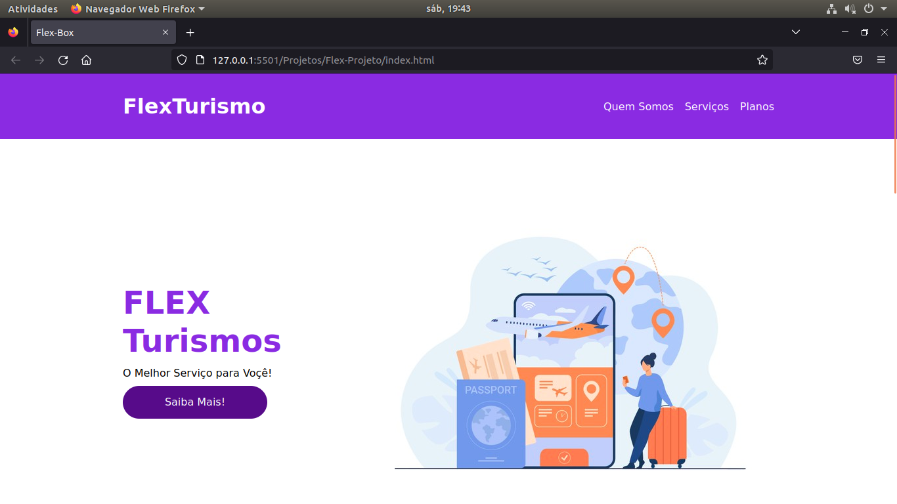

<<<<<<< HEAD
# Desenvolvimento-Web
 - Aulas da Digital Innovation One 
 - Foco em Desenvolvimento WEB
 - Todo conteúdo de HTML, CSS, JavaScript 
 - Completar Curso de Git e GitHUb
 - PHP  
 - Reactjs 
 - Vuejs
 - Nodejs
 - Banco de Dados Mysql

 ### Posicionamento com Flexbox em Css
- Inicio em 09/12/2021
- Pasta de Referência Flexbox em CSS
- Aulas concluidas 
- 10/12/2021
- Inicio do projeto prático -> Projetos / Flex-Projeto
- 10/12/2021
- Desenvolvimento da página em andamento 
- Parando ás 20h57m - 10/12/2021
- -----------------------------------------------------
- 11/12/021
- Início ás 12h30m
- Interface da Website
- Resposividade Implementada
- Conclusão das aulas do Projeto
- 14h10m - Concluído
- --------------------------------------------

=======
# Home Page com conceitos de Flebox

#
## Tela Inicial
#

#

# Desenvolvimento-Web
 - Aulas da Digital Innovation One 
 - Foco em Desenvolvimento WEB
 - Todo conteúdo de HTML, CSS, JavaScript 
 - Completar Curso de Git e GitHUb
 - PHP  
 - Reactjs 
 - Vuejs
 - Nodejs
 - Banco de Dados Mysql

#

 ### Posicionamento com Flexbox em Css
- Inicio em 09/12/2021
- Pasta de Referência Flexbox em CSS
- Aulas concluidas 
- 10/12/2021
- Inicio do projeto prático -> Projetos / Flex-Projeto
- 10/12/2021
- Desenvolvimento da página em andamento 
- Parando ás 20h57m - 10/12/2021
- 

#
>>>>>>> 45ed5e9fcd3729e366b3b10cb85964a9b100294e
